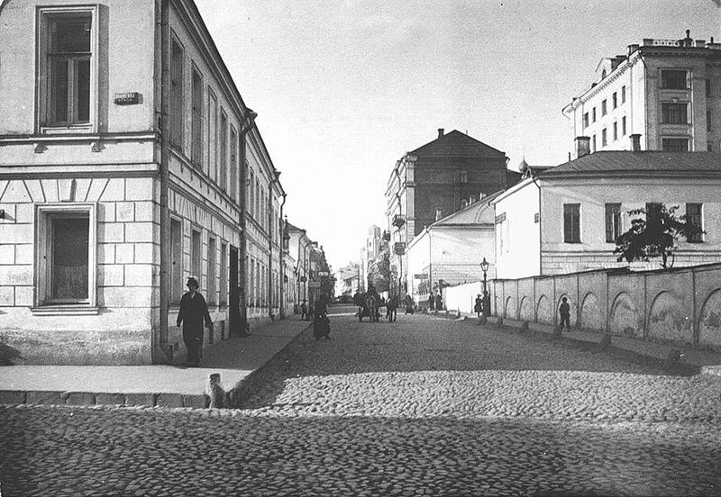
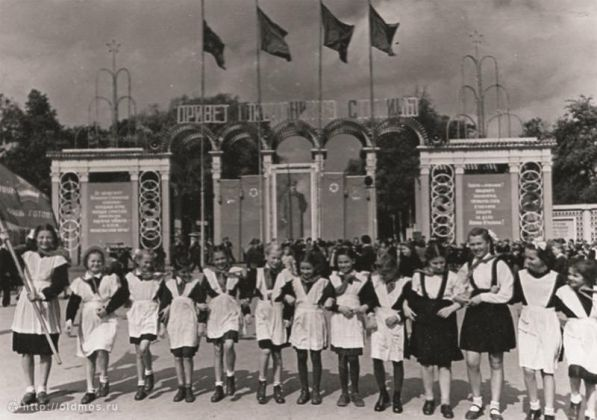
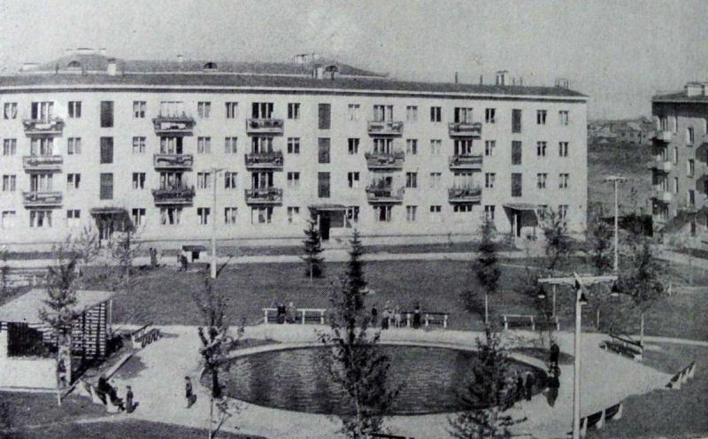

## История озеленения Москвы

Москва — город древний. Она неоднократно меняла свой облик, а последний раз отстраивалась заново после пожара 1812 года. Поэтому историю озеленения Москвы мы хотим начать с конца XVIII века. 

Первые садовые ассамблеи начали появляться еще во времена Петра Великого, однако масштабные проекты по озеленению Москвы были подготовлены при императрице Екатерине II (создана «Комиссия для устройства городов Санкт-Петербурга и Москвы»).

В апреле 1775 года был разработан «План Москвы, прожектированный по городу и предместьям», в котором предусматривался снос устаревших оборонительных сооружений Белого города, а на освободившемся месте предлагалось сформировать длинные аллеи бульваров. Сначала на них попробовали высаживать березы. Но эти русские красавицы закапризничали и стали чахнуть. Пришлось заменять их липами. А на Тверском посадили вдоль дорожек шелковицу — ради пущей оригинальности! Однако вскоре выяснилось, что в холодной Москве шелковичные деревья весной очень поздно дают листву, и их почти сразу заменили на липы и клены.

>Бульварное кольцо

В течение 19го века зеленые зоны расширялись и приукрашались. 

 
>В. Ф. Аммон, "Вид Москвы с Воробьёвых гор", 1856 год.

В начале XX века с введением индустриализации началось массовая вырубка деревьев, садов и аллей. Предпочтение отдавалось широким автомобильным дорогам, а не зелёным аллеям. 

>Крестовоздвиженский переулок, 1910-е годы

В Сталинский период в ущерб зеленым насаждениям расширялись автодороги, строились здания. Эта тенденция сохранялась на протяжении долгого времени. При этом расширялись парки: Сокольники, Измайловский и другие.

>Отряд пионеров перед входом в парк Сокольники

Во время Великой отечественной войны озеленение Москвы серьёзно пострадало. Газоны засеивались съедобными культурами, а деревья шли на отопление города.

>Зенитная батарея на территории Московского Зоопарка

В 60-х годах население Москвы стремительно увеличивалось, появлялись новые районы на окраинах. Возникла потребность в их экстренном озеленении. Было принято решение посадить тополя ввиду их неприхотливости и высокой скорости роста. Из-за необходимости быстрого проведения работ по посадке отбор мужских саженцев тополей не производился, и в Москве летом стал появляться надоедливый пух. Тополь очень быстро распространился по территории Москвы.

>Хрущевка

С 2014 года было принято решение о замене тополей на другие деревья, в том числе на «непушистые» тополя, ввиду того, что пух переносит аллергены и загрязняет улицы. В год заменяют от пяти до десяти тысяч подобных деревьев. Заменить все надоедающие тополя обещают до конца 2020 года.

