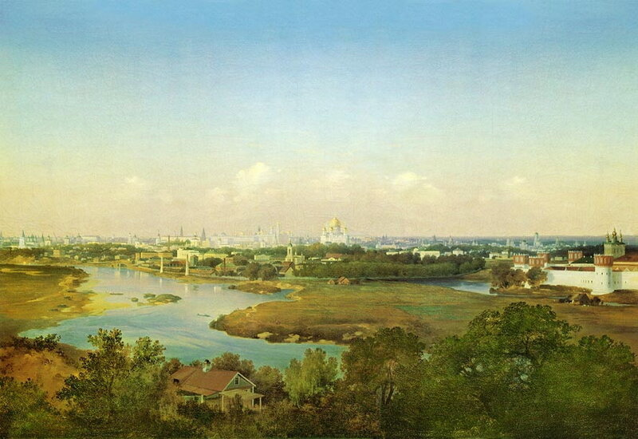
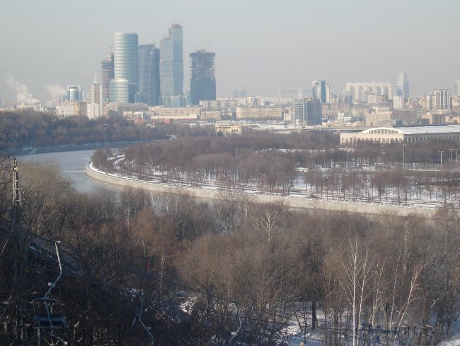

#Зеленая Москва

|         |            |  
| :-------------: |:-------------:| 
|  |  |
|       |       |

Человек не может существовать отдельно от растений, но, к сожалению, в современных городах сложно создать подходящие условия для растений.  

Наша студия провела небольшое исследование, чтобы выяснить, что растёт в разных районах Москвы и как себя чувствует.  
На основе полученного материала мы выяснили, какие проблемы с растениями существуют в Москве.

