|    **Растение**     | **Фотография**          | **Характеристики**  |
| ------------- |:-------------:| :-----:|
| Рябина      | 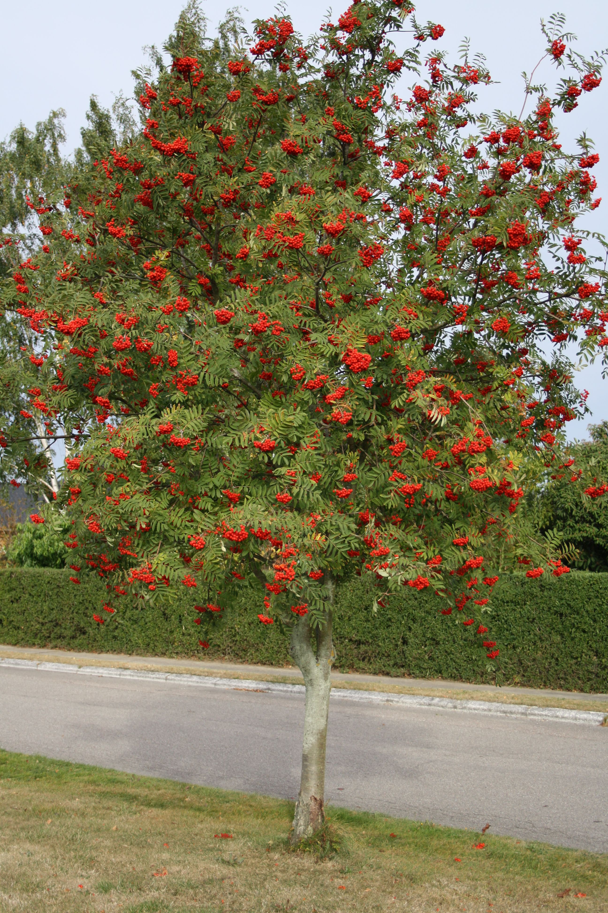 | Рябина обыкновенная, вследствие большой её распространённости и невысокого качества её плодов, принадлежит к числу малоценных плодовых деревьев. Рябина часто разводится как декоративное дерево; плоды её идут в пищу, а тяжёлая, упругая, прочная древесина — для столярных изделий. **Хорошо приспособлена к городу**.|
| Дуб      | 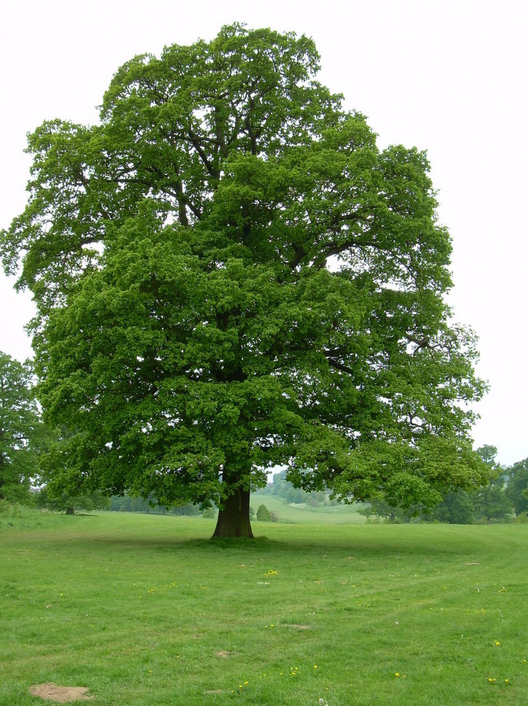      |   Большинство дубов — это здоровые, плотные деревья. Многие виды этого рода принадлежат к числу так называемых вечнозелёных, то есть снабжены кожистыми листьями, остающимися на растении по нескольку лет. Дубы часто высаживают для озелененея городов. **Устойчивость к городским факторам: высокая**. |
| Липа | 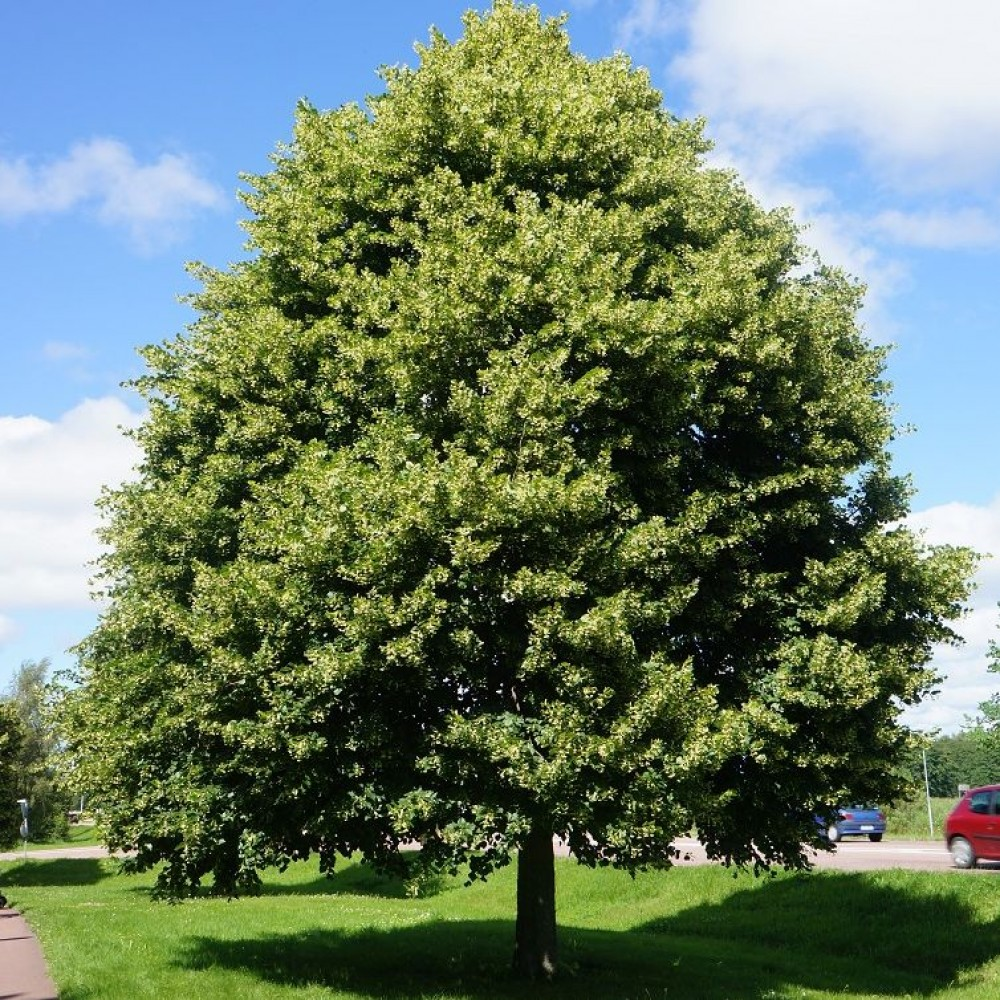      |    Липа является одной из основных пород, широко используемых в озеленении городов различных климатических зон России. Растения этого вида используют в уличных насаждениях в скверах, парках и лесопарках, а в последнее время и на больших приусадебных участках. Главными достоинствами практически всех лип являются компактность, густолиственной кроны, **теневыносливость**, **относительная нетребовательность к почвенным условиям**, **ветроустойчивость**, **неаллергенность**, **довольно высокая устойчивость к агрессивной городской среде – дыму, грязи, пыли, загазованности**. |
|Каштан|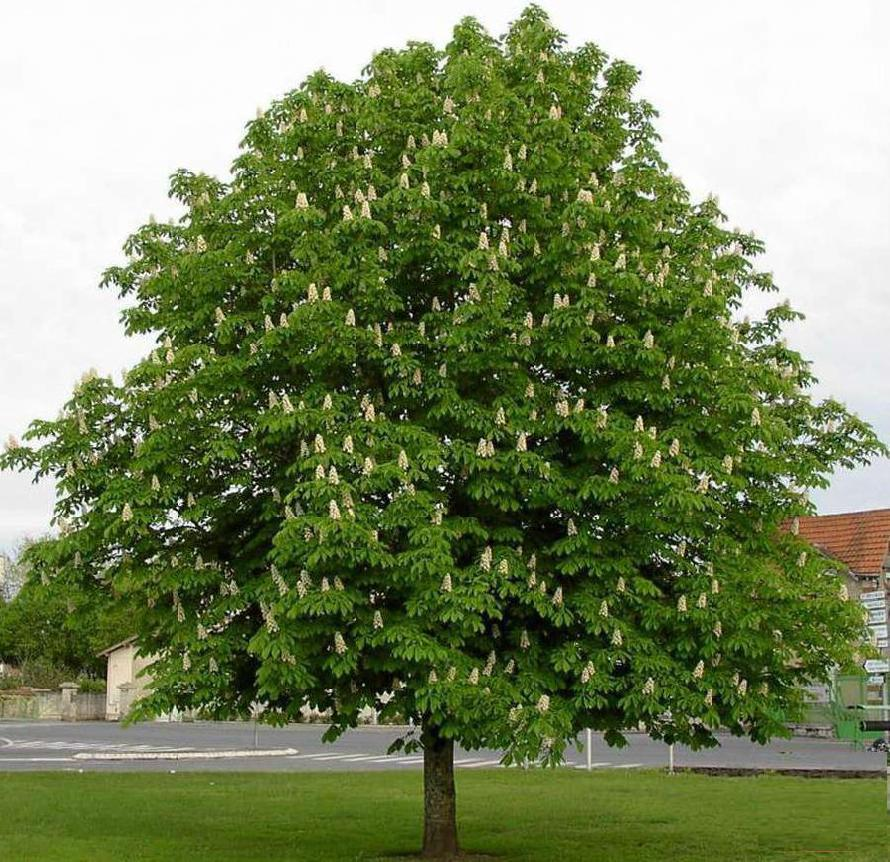|Каштан образует эффектную, плотную крону крупной листвой, которая осенью окрашивается в разноцветье пурпурных, багряных, желтых и коричневых оттенков. Мощные растения с оригинальными соцветиями и плодами-коробочками потрясающе красивы! К тому же, они **отлично приспособлены к городским условиям существования. Каштаны могут превосходно расти и развиваться даже в загрязненной атмосфере.**|
|Клён|||||
|Чубушник (садовый жасмин)|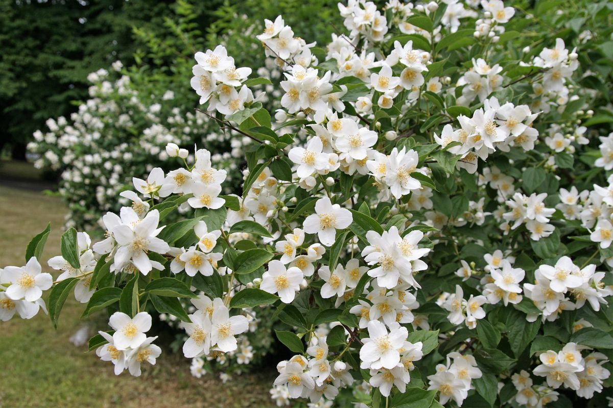|Сорта чубушников **относительно неприхотливы** в культуре, могут выращиваться как на открытых солнцу участках, так и в полутени. При недостатке освещения ухудшается цветение. Не выносят заболачивания и застоя воды, при засухе быстро отцветают. Подкормки минеральными удобрениями рекомендуется производить в начале вегетации и после цветения. Кусты с годами делаются очень густыми и нуждаются в прореживании, иначе цветение ослабевает. Обрезку рекомендуется проводить сразу после цветения.
|Ясень||Ясень обыкновенный - крупное листопадное дерево с широкоовальной кроной. **Хорошо растёт только на самых плодородных почвах**. **Засоленности почв не переносит**. **Морозостойкость высокая**, но молодые побеги часто повреждаются весенними заморозками и сильными морозами. **Теневыносливость средняя**. Ясень обыкновенный является быстрорастущей породой. Применяется в групповых и рядовых посадках.|
|Боярышник|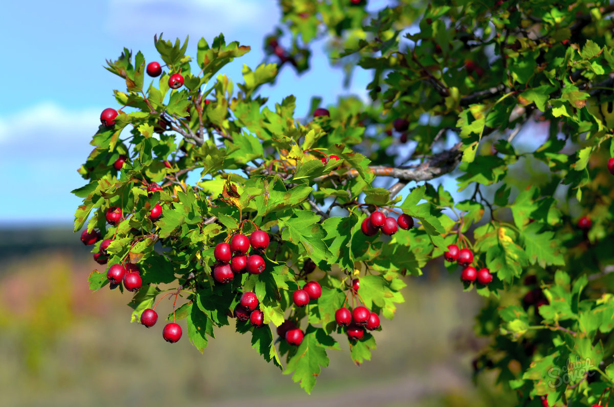|Распространены в самых различных условиях рельефа и на разных грунтах. **К почве нетребовательны**, но лучше развиваются на глубоких, среднеувлажнённых, хорошо дренированных плодородных тяжёлых почвах; положительно реагируют на присутствие извести в почве. **В культуре неприхотливы, в подавляющем большинстве зимостойки, светолюбивы**. **Не требуют специального ухода**, кроме периодической подрезки и вырезки сухих ветвей.|
|Яблоня|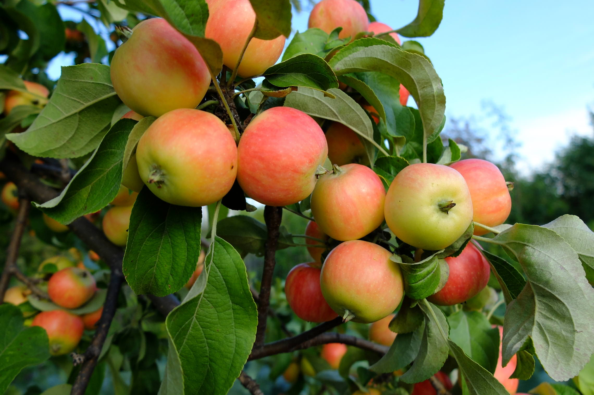|Деревья с развесистой кроной. Цветут яблони душистыми цветками белого, розового, красноватого и даже карминового цвета, полностью укрывая деревья ароматным облаком. Эта культура отличается **высокой зимостойкостью** и **нетребовательностью к почвенному плодородию**.|
|Груша|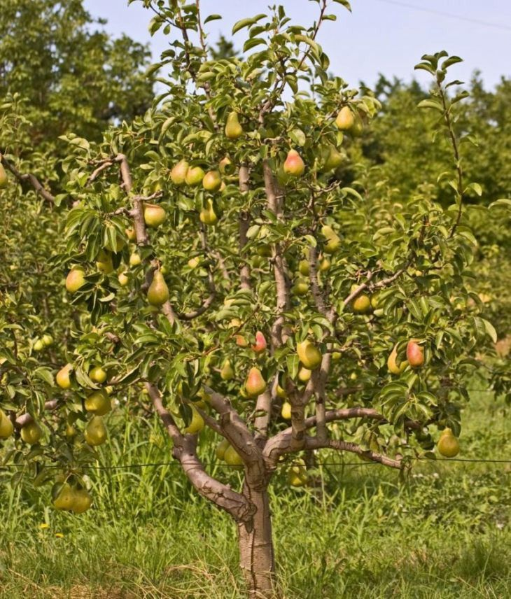|Груша является деревом, обладающим пирамидальной либо округлой кроной. Она широко применяется в озеленении и садово-парковом исусстве как декоративное растение с яркими красивыми плодами жёлтой или зелёной окраски, с румянцем или без него. Груша — **светолюбивое, но капризное растение: избыточную влагу и длительную засуху переносит плохо; по морозостойкости уступает яблоне и вишне**.|
|Слива|.jpg)|Слива – естественный гибрид алычи и терна. Это дерево с высокой переносимостью неблагоприятных природных условий и возможностью прижиться на неприспособленной для этого почве. Слива является превосходным медоносом. Продолжительность жизни дерева зависит от сорта и может достигать 25 лет, продуктивный период 10—15 лет.|
|Черёмуха|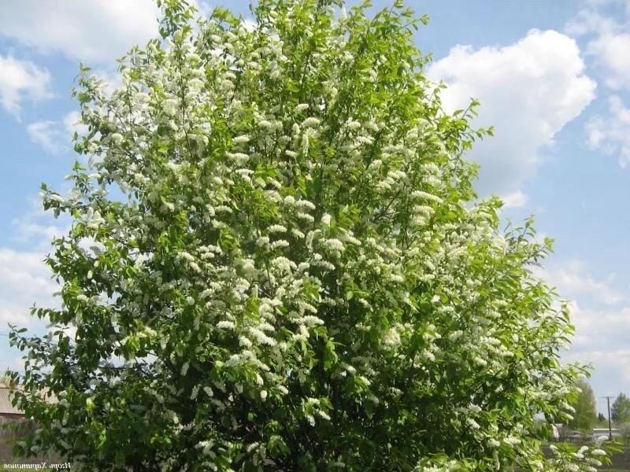|Дерево, деревце или крупный кустарник. Крона удлиненная и густая. Кора матовая, черно-серая, с беловатыми чечевичками. Обильно цветёт ежегодно, однако плодоносит не каждый год, так как **цветки повреждаются запоздалыми весенними заморозками**. А **сами деревья подвергаются нападению многочисленных вредителей**. Черемуха предпочитает влажные и богатые почвы с близким залеганием внутренних вод.|
|Сирень|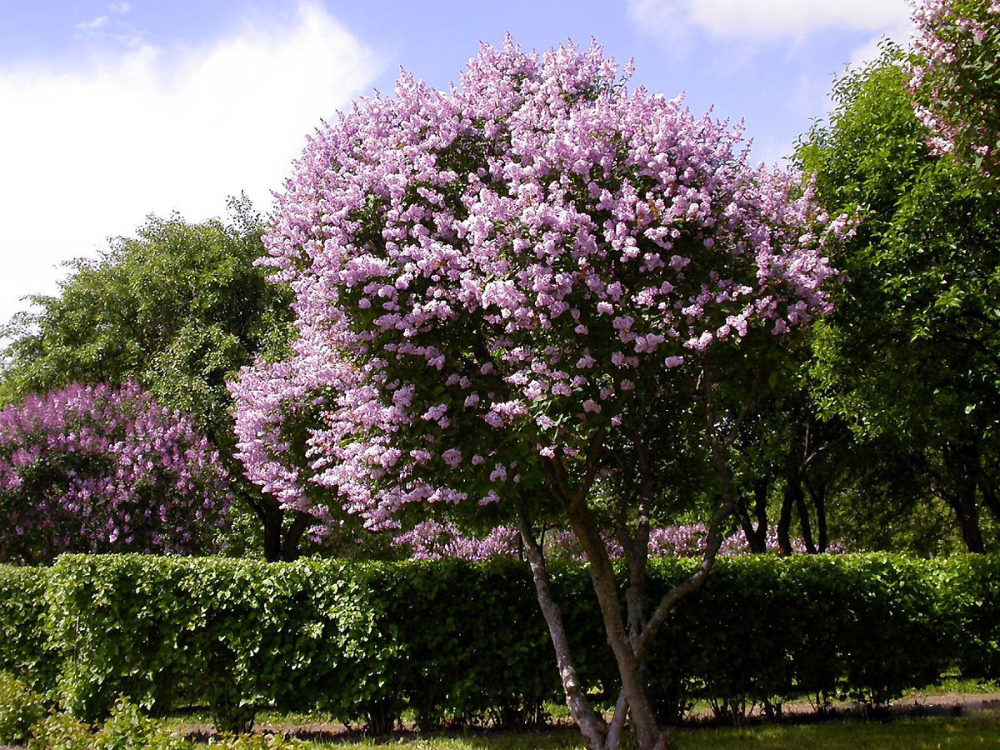|Неприхотливый кустарник, который часто выращивают для декоративных целей, он может расти практически без ухода, в течение долгих лет сохранять красивую форму и пышно цвести. Куст сирени в зависимости от вида достигает высоты 1,5-2 и до 5 метров, а в ширину крона куста может разрастаться до 3 метров и более в диаметре. Взрослые кусты сирени очень устойчивы к засухе и практически не нуждаются в поливах. Сирень хорошо цветет только на солнечном месте или в таком, где солнце будет освещать куст первую половину дня. Сирень не требовательна к почвам, хорошо растет на плодородной рыхлой земле с нейтральной или слабокислой реакцией. Низкие заболоченные участки, также часто подтопляемые весной талыми водами, а летом дождевыми, не подходят для выращивания сирени.|
|Клён ясенелистный|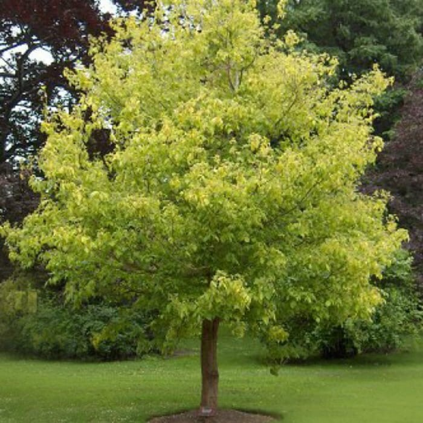|Клён ясенелистный, или американский (лат. Acer negundo) – вид рода Клён, семейства Сапиндовые. Это дерево высотой до 10-25 м, с диаметром ствола в 30-50 см, реже кустообразная форма. Несмотря на высокую неприхотливость, имеет много существенных недостатков: высокая ломкость ветвей и подверженность корня гниению, приводят к падению взрослых деревьев. Большое количество пыльцы, вызывающей аллергию у людей. При распаде части дерева вырабатывают яды, которые отравляют воздух и почву.
|Клён сахарный|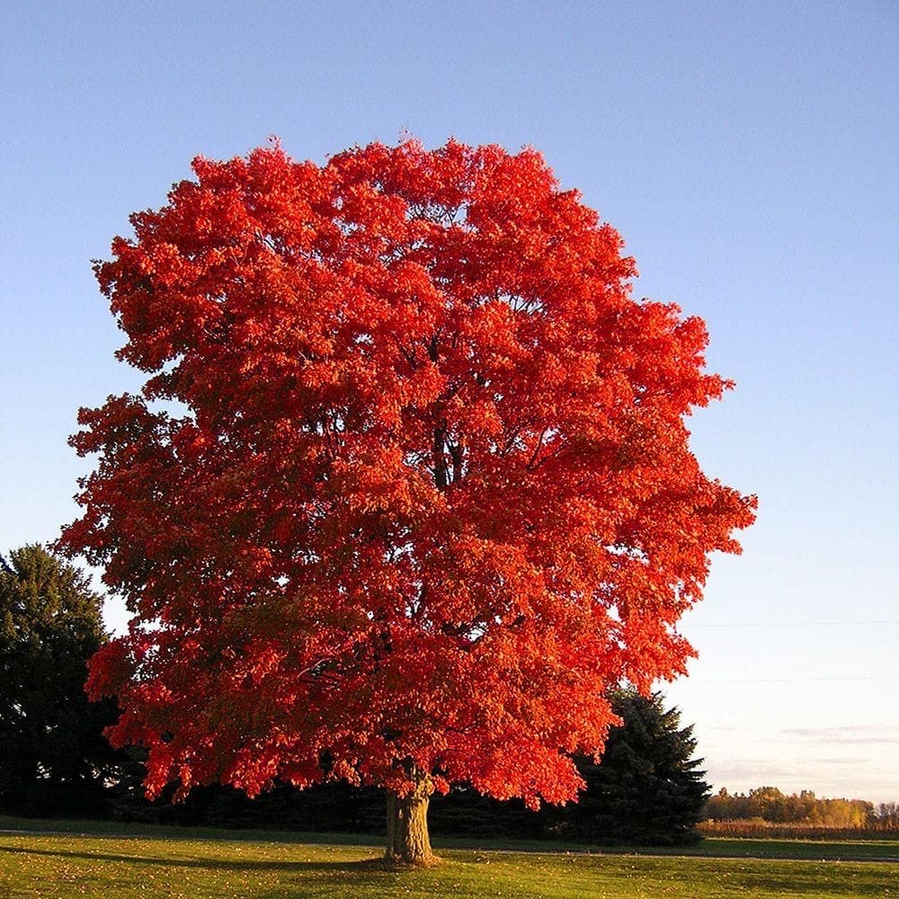|Клён сахарный (лат. Ácer sáccharum) — листопадное дерево семейства (Sapindaceae) В высоту вырастает от 25 до 40 метров, обхват при этом составляет от 76 до 91 сантиметра, живут от трёхсот до четырёхсот лет. Крона густая, раскидистая. Корни глубокие, сильно ветвящиеся. В основном, канадский клён применяется в получении кленового сиропа, древесины, создания защиты дорог от снега и ветра, как декоративное растение.
|Тополь|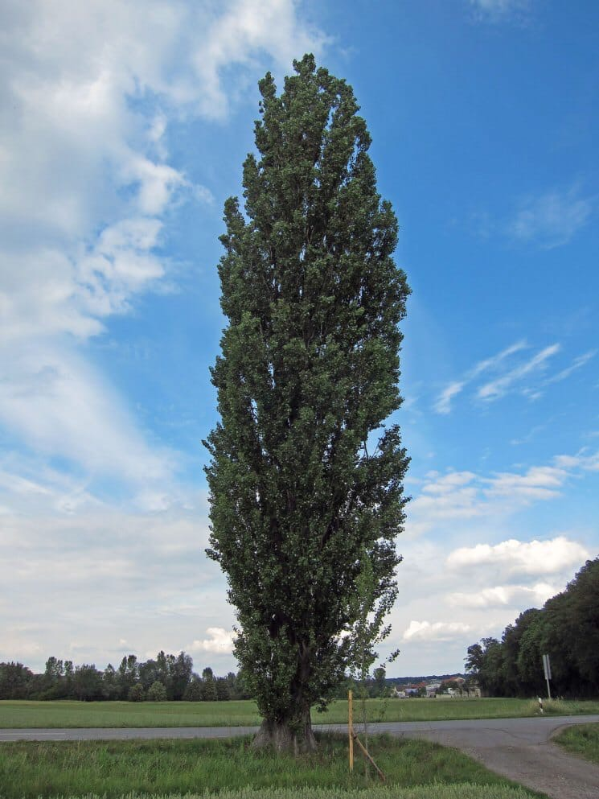|Тополь (от лат. Populus) – Большинство взрослых экземпляров всех видов достигают в высоту 30–35 м. Стволы прямые, диаметром 60–120 см, разветвления встречаются редко. Кроны густые, шатровидной или пирамидальной формы. Свойство тополей очищать воздух от пыли и газов незаменимо для городских улиц. Быстрорастущие прямоствольные деревья подходят для высаживания в парках, скверах, вдоль дорожных полотен. Виды с компактными декоративными кронами: осокорь или пирамидальный тополь, можно выращивать на границах участков. Разведение только мужских экземпляров позволяет избавиться от главной досады тополевых насаждений – летнего «снегопада» из комьев пуха.
|Берёза|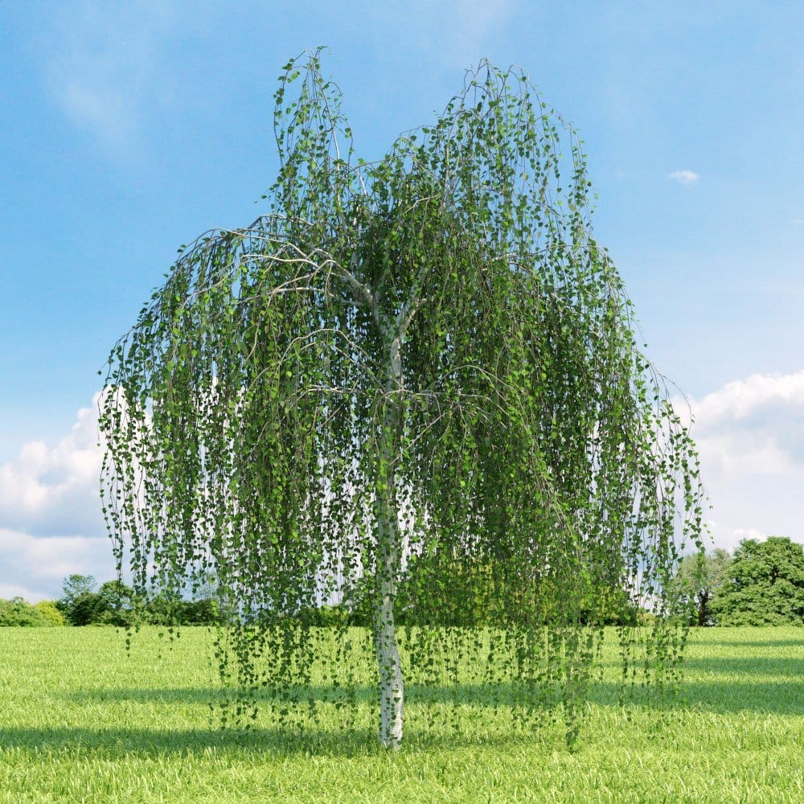|Берёза (лат. Bétula) — род листопадных деревьев и кустарников семейства Берёзовые (Betulaceae). Большинство видов берёз — деревья высотой до 30 и даже 45 м, с обхватом ствола до 120—150 см. Продолжительность жизни берёзы, по разным данным, — 100—120 лет, 110—150 лет, отдельные деревья доживают до 400 лет и более.
|Туя|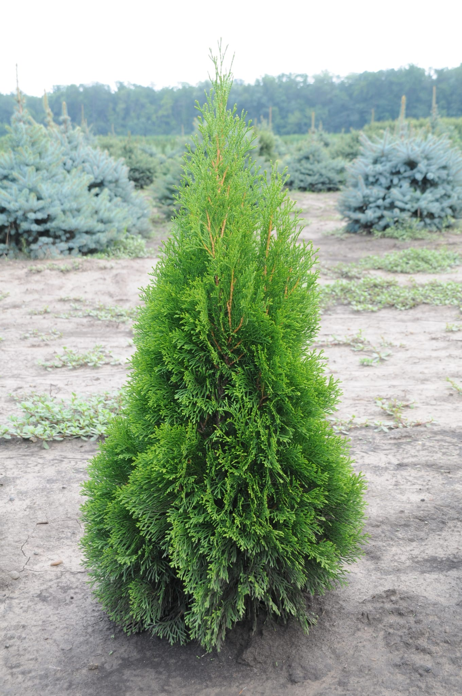|Ту́я за́падная, или жи́зненное де́рево, или негниючка (лат. Thúja occidentális), — вечнозелёное хвойное дерево из семейства Кипарисовых (лат. Cupressaceae) рода Туя. Благодаря большому количеству высокодекоративных искусственно выведенных форм, зимостойкости, долговечности и устойчивости к городским условиям. Пыле-, дымо-, газоустойчива, хорошо переносит пересадку, обрезку, стрижку. Зимостойка.
|Шиповник|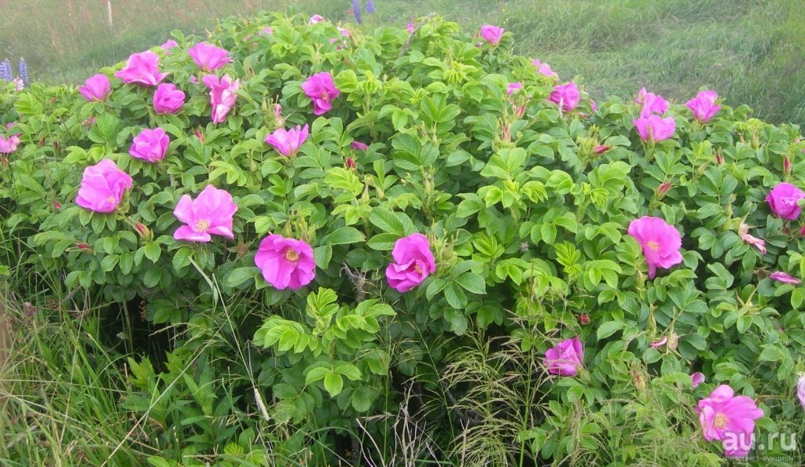|Латинское название рода Rosa произошло от древнеперсидского "wrodon", которое на греческом диалекте трансформировалось в "rhodon", а потом в латинском языке - в "rosa". Кустарник с прямостоячими толстыми ветвями от 2 до 6 м, по другим данным, от 0,8 до 1 (1,5) м в высоту, при благоприятных условиях образует густые непроходимые заросли. Шиповник морщинистый по своим декоративным качествам не уступает культурным сортовым розами, поэтому широко выращивается в нашей стране в городах, поселках и на приусадебных участках. Кроме того, он устойчив к низким зимним температурам, заболеваниям и вредителям, которые часто поражают культурные сорта. Благодаря своей мощной и глубокой корневой системе, этот вид шиповника является идеальным вариантом для закрепления почвы в противоэрозионных насаждениях по склонам холмов и оврагов. Именно роза морщинистая и ее сорта были в свое время использованы для высадки на песчаных дюнах в пригородах Кёнигсберга.
|Виноград|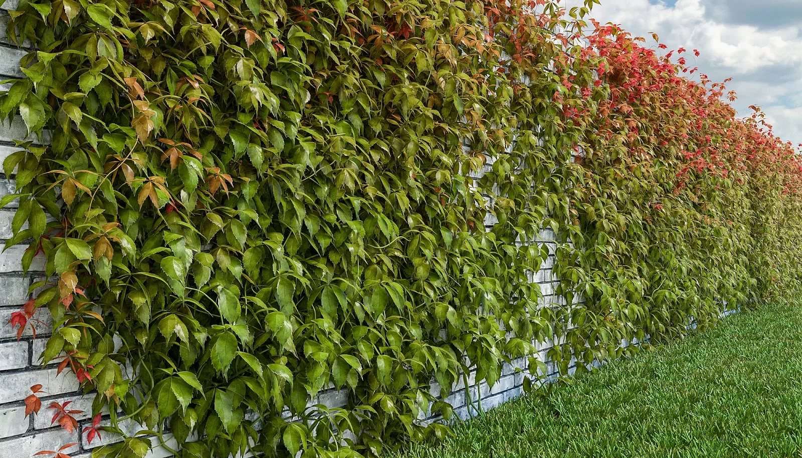|Латинское название девичьего винограда — Parthenocissus, что в переводе значит «девственный плющ». Встречается около 10 видов девичьего винограда. Обычно это крупные лианы с плотной кроной и крепким деревянным стволом. Морозостоек, хорошо растёт как на солнце, так и в тени. Не боится загрязнённого воздуха.
|Жимолость|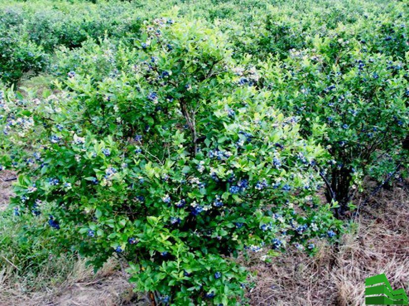|Жи́молость (лат. Lonícera) — род прямостоячих, вьющихся или ползучих кустарников; типовой род семейства Жимолостные (Caprifoliaceae). Это многолетний листопадный кустарник со съедобными плодами, высотой один-два метра. Крона густая, шаровидной формы. Листья ланцетные, продолговатые длиной до 7 см. В Московской области часто страдает от повторного осеннего цветения, которое значительно ослабляет растение и препятствует благополучной зимовке и обильному плодоношению в следующем сезоне. Главной причиной этого является тёплая погода в сентябре-октябре.