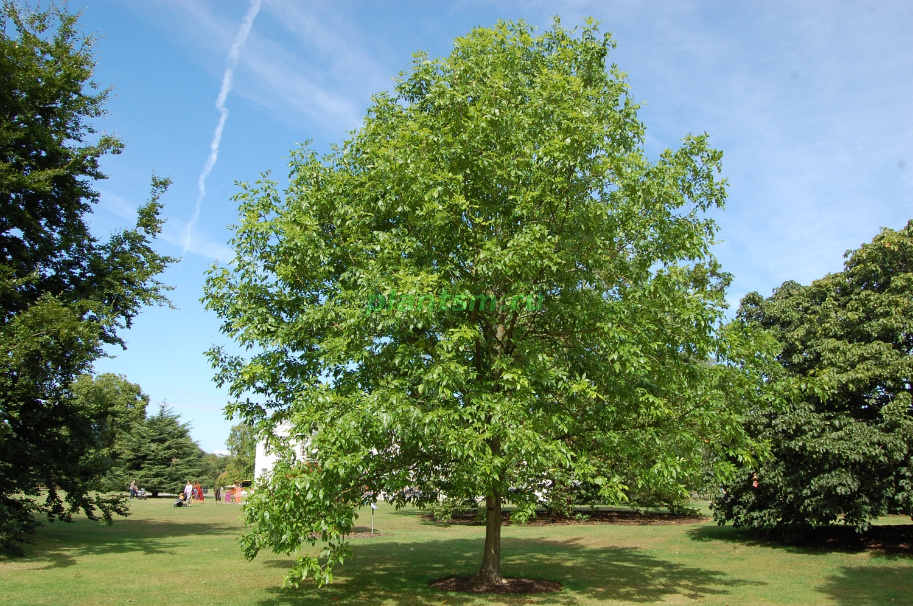

|    **Растение**     | **Фотография**          | **Характеристики**  |
| ------------- |:-------------:| :-----:|
| Рябина      |  | Рябина обыкновенная, вследствие большой её распространённости и невысокого качества её плодов, принадлежит к числу малоценных плодовых деревьев. Рябина часто разводится как декоративное дерево; плоды её идут в пищу, а тяжёлая, упругая, прочная древесина — для столярных изделий. **Хорошо приспособлена к городу**.|
| Дуб      |       |   Большинство дубов — это здоровые, плотные деревья. Многие виды этого рода принадлежат к числу так называемых вечнозелёных, то есть снабжены кожистыми листьями, остающимися на растении по нескольку лет. Дубы часто высаживают для озелененея городов. **Устойчивость к городским факторам: высокая**. |
| Липа |       |    Липа является одной из основных пород, широко используемых в озеленении городов различных климатических зон России. Растения этого вида используют в уличных насаждениях в скверах, парках и лесопарках, а в последнее время и на больших приусадебных участках. Главными достоинствами практически всех лип являются компактность, густолиственной кроны, **теневыносливость**, **относительная нетребовательность к почвенным условиям**, **ветроустойчивость**, **неаллергенность**, **довольно высокая устойчивость к агрессивной городской среде – дыму, грязи, пыли, загазованности**. |
|Каштан||Каштан образует эффектную, плотную крону крупной листвой, которая осенью окрашивается в разноцветье пурпурных, багряных, желтых и коричневых оттенков. Мощные растения с оригинальными соцветиями и плодами-коробочками потрясающе красивы! К тому же, они **отлично приспособлены к городским условиям существования. Каштаны могут превосходно расти и развиваться даже в загрязненной атмосфере.**|
|Клён|||||
|Чубушник (садовый жасмин)||Сорта чубушников **относительно неприхотливы** в культуре, могут выращиваться как на открытых солнцу участках, так и в полутени. При недостатке освещения ухудшается цветение. Не выносят заболачивания и застоя воды, при засухе быстро отцветают. Подкормки минеральными удобрениями рекомендуется производить в начале вегетации и после цветения. Кусты с годами делаются очень густыми и нуждаются в прореживании, иначе цветение ослабевает. Обрезку рекомендуется проводить сразу после цветения.
|Ясень||Ясень обыкновенный - крупное листопадное дерево с широкоовальной кроной. **Хорошо растёт только на самых плодородных почвах**. **Засоленности почв не переносит**. **Морозостойкость высокая**, но молодые побеги часто повреждаются весенними заморозками и сильными морозами. **Теневыносливость средняя**. Ясень обыкновенный является быстрорастущей породой. Применяется в групповых и рядовых посадках.|
|Боярышник||Распространены в самых различных условиях рельефа и на разных грунтах. **К почве нетребовательны**, но лучше развиваются на глубоких, среднеувлажнённых, хорошо дренированных плодородных тяжёлых почвах; положительно реагируют на присутствие извести в почве. **В культуре неприхотливы, в подавляющем большинстве зимостойки, светолюбивы**. **Не требуют специального ухода**, кроме периодической подрезки и вырезки сухих ветвей.|
|Яблоня||Деревья с развесистой кроной. Цветут яблони душистыми цветками белого, розового, красноватого и даже карминового цвета, полностью укрывая деревья ароматным облаком. Эта культура отличается **высокой зимостойкостью** и **нетребовательностью к почвенному плодородию**.|
|Груша||Груша является деревом, обладающим пирамидальной либо округлой кроной. Она широко применяется в озеленении и садово-парковом исусстве как декоративное растение с яркими красивыми плодами жёлтой или зелёной окраски, с румянцем или без него. Груша — **светолюбивое, но капризное растение: избыточную влагу и длительную засуху переносит плохо; по морозостойкости уступает яблоне и вишне**.|
|Слива|.jpg)|Слива – естественный гибрид алычи и терна. Это дерево с высокой переносимостью неблагоприятных природных условий и возможностью прижиться на неприспособленной для этого почве. Слива является превосходным медоносом. Продолжительность жизни дерева зависит от сорта и может достигать 25 лет, продуктивный период 10—15 лет.|
|Черёмуха||Дерево, деревце или крупный кустарник. Крона удлиненная и густая. Кора матовая, черно-серая, с беловатыми чечевичками. Обильно цветёт ежегодно, однако плодоносит не каждый год, так как **цветки повреждаются запоздалыми весенними заморозками**. А **сами деревья подвергаются нападению многочисленных вредителей**. Черемуха предпочитает влажные и богатые почвы с близким залеганием внутренних вод.|
|Сирень||Неприхотливый кустарник, который часто выращивают для декоративных целей, он может расти практически без ухода, в течение долгих лет сохранять красивую форму и пышно цвести. Куст сирени в зависимости от вида достигает высоты 1,5-2 и до 5 метров, а в ширину крона куста может разрастаться до 3 метров и более в диаметре. Взрослые кусты сирени очень устойчивы к засухе и практически не нуждаются в поливах. Сирень хорошо цветет только на солнечном месте или в таком, где солнце будет освещать куст первую половину дня. Сирень не требовательна к почвам, хорошо растет на плодородной рыхлой земле с нейтральной или слабокислой реакцией. Низкие заболоченные участки, также часто подтопляемые весной талыми водами, а летом дождевыми, не подходят для выращивания сирени.|
